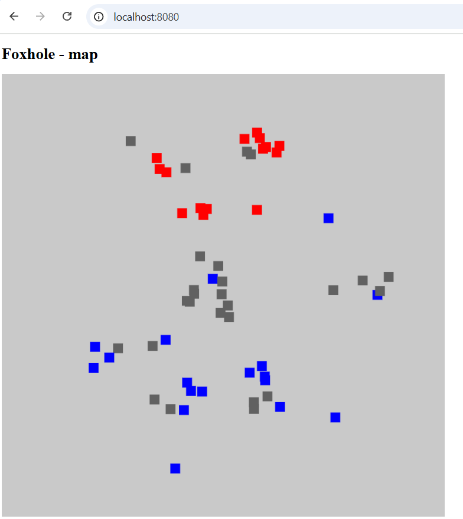

# Foxhole - front visualisator
Foxhole is a game. People are fighting as a fraction with other fractions. The key is the communication, logistics and teamwork.

I created that visualisator just for fun. I haven't even played the game.
It has public API that provides data about current (in-game) war, and I wanted to mess around with
quick FastAPI and JS.

    </img/>

